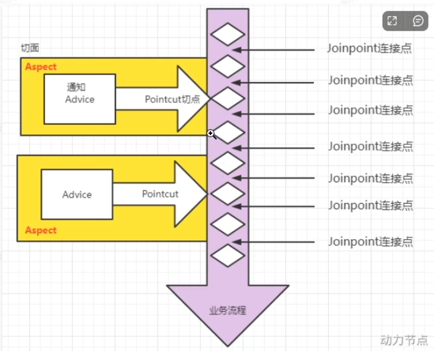
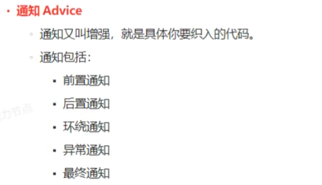

# AOP七大术语

## 1.切面（Aspect）

### 定义

切面是模块化的横切关注点。它将与业务逻辑无关的功能集中在一个独立的模块中，比如日志记录、事务管理等。

也就是切点+通知。

### 作用

切面定义了横切关注点如何应用于程序的不同部分。

## 2.连接点（Join Point）

### 定义

连接点是程序中可以插入切面的特定点。通常，方法的调用、对象的初始化等都可以作为连接点。

### 作用

连接点是潜在的切入位置，AOP 通过连接点识别程序中的横切点。

## 3.切点（Pointcut）

### 定义

切点定义了在哪些连接点上应用切面。它通过匹配规则，筛选出适合应用横切关注点的连接点。

### 作用

切点决定了切面在哪些地方生效，类似于过滤器的功能。

## 4.通知（Advice）

### 定义

通知是在连接点处执行的具体动作，它定义了切面逻辑。常见的通知类型有“前置通知”、“后置通知”和“异常通知”等。

### 作用

通知实现了横切关注点的具体逻辑，在特定条件下触发执行。

## 5.织入（Weaving）

### 定义

织入是将切面代码与目标业务逻辑代码组合在一起的过程。织入可以发生在编译时、类加载时或运行时。

### 作用

通过织入，横切关注点可以在不修改业务代码的情况下被应用到系统中。

## 6.目标对象（Target Object）

### 定义

目标对象是包含实际业务逻辑的对象，代表系统中要执行的核心功能模块。例如，处理订单的服务对象就是一个目标对象。

### 作用

目标对象执行具体的业务逻辑，但并不包含横切关注点相关的代码，如日志记录、事务管理等。

## 7.代理对象（Proxy Object）

### 定义

代理对象是对目标对象的一种包装，通过代理对象来控制对目标对象方法的调用。代理对象能够在调用目标对象方法前后插入横切逻辑（如日志、权限验证）。

### 作用

代理对象在不修改目标对象的情况下，添加了横切逻辑的功能，从而实现 AOP 的织入。