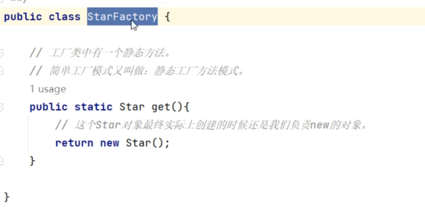
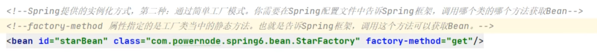
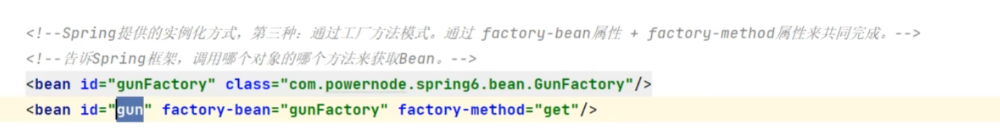
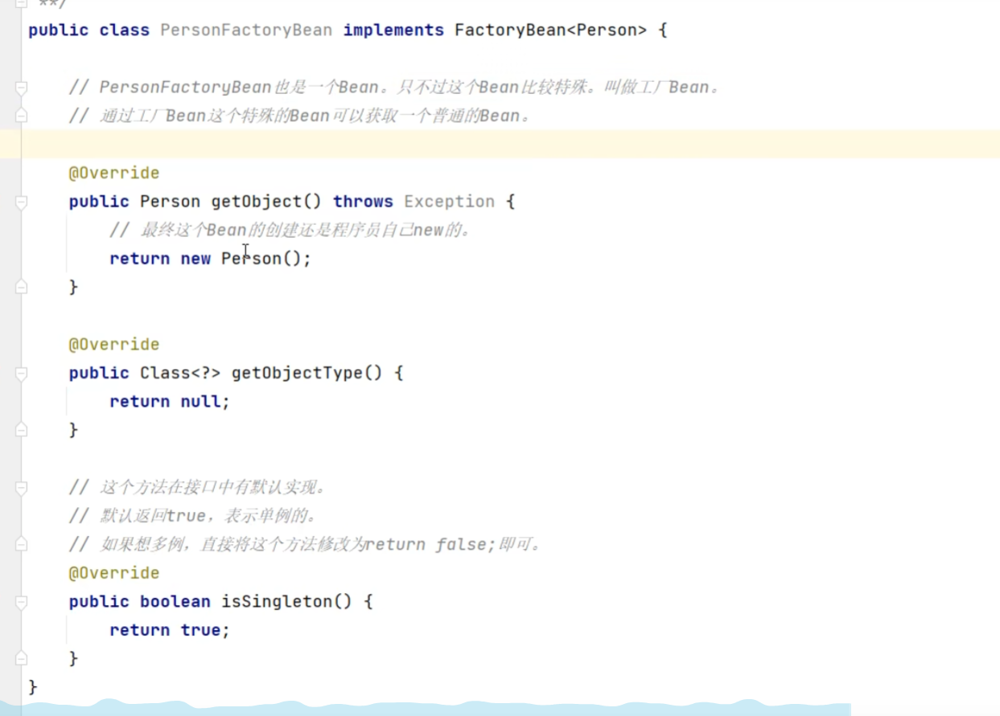
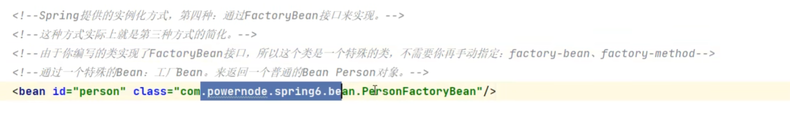

# Bean的实例化

## 分类

1.通过构造方法

2.通过简单工厂模式

3.通过factory-bean实例化

4.通过FactoryBean接口实例化

## 使用方法

### 1.通过构造方法

引入pom依赖，配置sprig文件。

### 2.通过简单工厂模式

1.写好相关的工厂类

2.在spring中配置bean

### 3.通过factory-bean实例化

1.创建工厂方法模式相关代码

2.配置spring文件

### 4.通过FactoryBean接口实例化

其实就是第三个方式的简化版

1.在工厂bean类继承FactoryBean接口。

2.配置spring文件即可

## 相关知识点

**BeanFactory**：这是一个接口，用于管理Spring应用中的所有Bean。它是Spring IoC容器的核心，负责Bean的创建、配置、依赖注入和生命周期管理。

**FactoryBean**：这是一个特殊的Bean，它用于创建其他Bean。通过实现`FactoryBean`接口，你可以自定义Bean的实例化逻辑。FactoryBean本身不是最终使用的Bean，而是用于生成和配置其他Bean的工具。