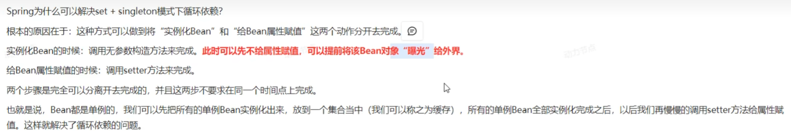

# Bean的循环依赖

你中有我，我中有你

## 单例模式

### 1.set注入

没有问题，因为每一种类型的对象只有一个。

### 2.构造注入

有问题，无法解决。

## 多例模式

### 1.set注入

#### 两个Bean对象的scope都是prototype：

存在问题，会出现当前的Bean创建中异常。

#### 一个是singleton一个是prototype：

没问题

## 相关知识点

## 只能解决set+singleton模式

基本原理

1.先创建Bean对象，此时属性为空

2.曝光Bean的工厂

3.从一级缓存取对象，不行就二级、三级。如果从三级取到了bean对象，会放到二级缓存。

