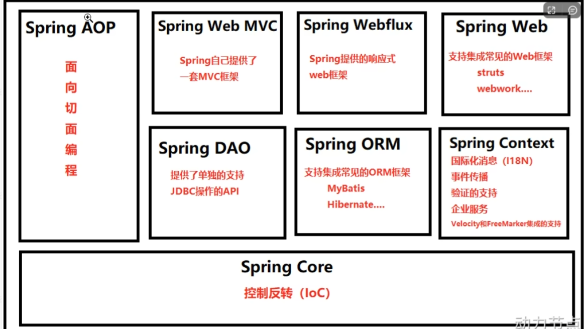

# Spring概念

## 定义

Spring 是一个开源的 Java 应用程序框架，旨在简化企业级应用程序的开发。它提供了全面的基础设施支持，使开发者可以专注于应用程序的业务逻辑，而不必处理繁琐的基础设施代码。

## 组成部分

### 1.核心容器（Core Container）

包括 Spring 核心模块、上下文模块、Bean 工厂等，提供 IoC 和 DI 功能。

### 2.数据访问/集成（Data Access/Integration）

包括 JDBC、ORM、OXM、JMS 和事务模块，简化数据库访问和事务管理。

### 3.Web 模块（Web Module）

包括 Web、Servlet、WebSocket 和 WebMVC 模块，支持构建 Web 应用程序和 RESTful 服务。

### 4.面向切面编程（AOP）

包括 AOP 模块和 AspectJ 集成，支持声明式事务管理、日志记录等。

### 5.测试模块（Test Module）

包括 JUnit 和 TestNG 支持，提供集成测试功能。

### 其他

包括消息、任务调度等模块。

## 结构形式

层次结构：

Spring 框架的各个模块按层次结构组织，核心容器在底层，上层依赖于底层模块。

## 分类

### 1.核心容器

Spring Core、Spring Context、Spring Beans。

### 2.数据访问和集成

Spring JDBC、Spring ORM、Spring OXM。

### 3.Web 模块

Spring Web、Spring MVC、Spring WebSocket。

### 4.面向切面编程

Spring AOP、Spring Aspects。

### 5.测试模块

Spring Test。

## 目的

### 1.简化开发

通过提供全面的基础设施支持，简化企业级应用程序的开发。

### 2.解耦合

通过依赖注入和控制反转，实现组件之间的松耦合。

### 3.增强测试性

通过支持依赖注入和模拟，方便单元测试和集成测试。

## 基本原理

Spring 框架通过 IoC 容器管理对象的生命周期和依赖关系，通过 AOP 提供横切关注点的支持。