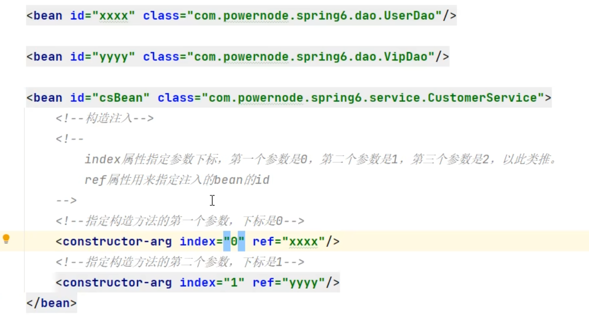
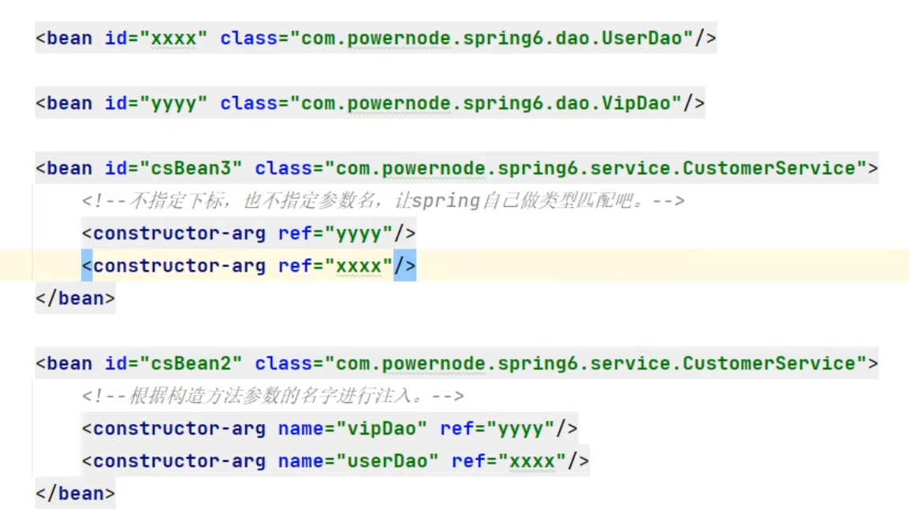

# 依赖注入

## 定义

依赖注入（Dependency Injection, DI）是一种设计模式，用于实现对象之间的依赖关系。它允许将对象的依赖关系在外部进行定义，从而解耦对象及其依赖项，提升代码的可维护性和可测试性。

## 组成部分

### 1.依赖

一个对象所依赖的另一个对象。

### 2.注入器

负责将依赖注入到对象中的组件或框架。

### 3.客户端

依赖注入的接收者，即需要依赖的对象。

## 结构形式

### 1.构造函数注入

依赖通过构造函数传递。

### 2.设值方法注入

依赖通过设值方法（setter）传递。

### 3.接口注入

依赖通过接口传递。

## 分类

### 1.手动注入

开发人员手动管理和注入依赖。

### 2.自动注入

使用依赖注入框架（如Spring）自动管理和注入依赖。

## 目的

通过依赖注入来解耦对象及其依赖项，提高代码的可维护性和可测试性。

## 基本原理

对象不自己创建依赖，而是通过外部注入这些依赖。对象的创建和依赖关系的管理由外部容器（如Spring容器）负责。

## 使用方法

### 1.set注入

①必须提供set方法，且这个方法以set开头。前三个字母不能随便写，必须是“set”。

②在Spring.xml中配置bean

### 2.构造注入

①提供构造方法

②spring.xml中配置

指定参数位置

类型匹配

