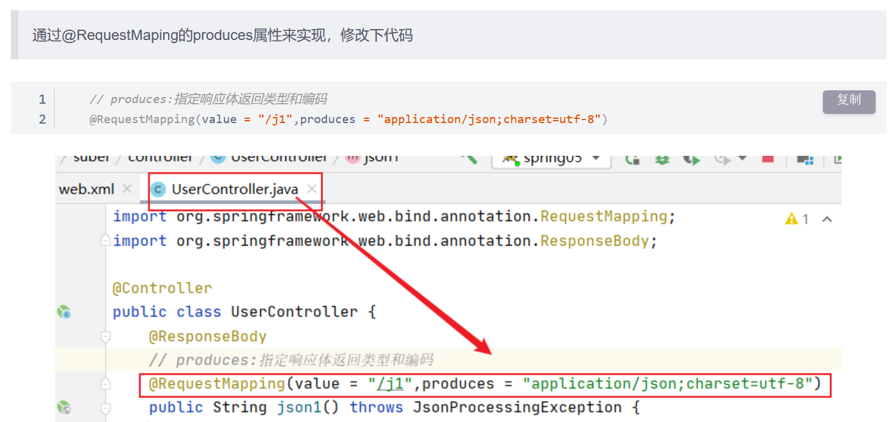

# Jackson使用

## 1.配置pom文件

```  pom
    <dependencies>
        <dependency>
            <groupId>com.fasterxml.jackson.core</groupId>
            <artifactId>jackson-databind</artifactId>
            <version>2.12.1</version>
        </dependency>
    </dependencies>

```

## 2.配置web.xml

 ``` xml
 <?xml version="1.0" encoding="UTF-8"?>
 <web-app xmlns="http://xmlns.jcp.org/xml/ns/javaee"
          xmlns:xsi="http://www.w3.org/2001/XMLSchema-instance"
          xsi:schemaLocation="http://xmlns.jcp.org/xml/ns/javaee http://xmlns.jcp.org/xml/ns/javaee/web-app_4_0.xsd"
          version="4.0">
 
     <!--1.注册servlet-->
     <servlet>
         <servlet-name>SpringMVC</servlet-name>
         <servlet-class>org.springframework.web.servlet.DispatcherServlet</servlet-class>
         <!--通过初始化参数指定SpringMVC配置文件的位置，进行关联-->
         <init-param>
             <param-name>contextConfigLocation</param-name>
             <param-value>classpath:springmvc-servlet.xml</param-value>
         </init-param>
         <!-- 启动顺序，数字越小，启动越早 -->
         <load-on-startup>1</load-on-startup>
     </servlet>
 
     <!--所有请求都会被springmvc拦截 -->
     <servlet-mapping>
         <servlet-name>SpringMVC</servlet-name>
         <url-pattern>/</url-pattern>
     </servlet-mapping>
 
     <filter>
         <filter-name>encoding</filter-name>
         <filter-class>org.springframework.web.filter.CharacterEncodingFilter</filter-class>
         <init-param>
             <param-name>encoding</param-name>
             <param-value>utf-8</param-value>
         </init-param>
     </filter>
     <filter-mapping>
         <filter-name>encoding</filter-name>
         <url-pattern>/</url-pattern>
     </filter-mapping>
 
 </web-app>
 
 ```

## 3.配置springmvc-servlet.xml

``` xml
<?xml version="1.0" encoding="UTF-8"?>
<beans xmlns="http://www.springframework.org/schema/beans"
       xmlns:xsi="http://www.w3.org/2001/XMLSchema-instance"
       xmlns:context="http://www.springframework.org/schema/context"
       xmlns:mvc="http://www.springframework.org/schema/mvc"
       xsi:schemaLocation="http://www.springframework.org/schema/beans
       http://www.springframework.org/schema/beans/spring-beans.xsd
       http://www.springframework.org/schema/context
       https://www.springframework.org/schema/context/spring-context.xsd
       http://www.springframework.org/schema/mvc
       https://www.springframework.org/schema/mvc/spring-mvc.xsd">

    <!-- 自动扫描指定的包，下面所有注解类交给IOC容器管理 -->
    <context:component-scan base-package="com.github.subei.controller"/>

    <!-- 视图解析器 -->
    <bean class="org.springframework.web.servlet.view.InternalResourceViewResolver"
          id="internalResourceViewResolver">
        <!-- 前缀 -->
        <property name="prefix" value="/WEB-INF/jsp/" />
        <!-- 后缀 -->
        <property name="suffix" value=".jsp" />
    </bean>

</beans>

```

## 4.使用

## PS:

### 乱码问题解决

#### 方式①

配置RequestMapping的produces属性



#### 方式②

配置spring文件

``` xml
    <!-- JSON乱码问题 -->
    <mvc:annotation-driven>
        <mvc:message-converters register-defaults="true">
            <bean class="org.springframework.http.converter.StringHttpMessageConverter">
                <constructor-arg value="UTF-8"/>
            </bean>
            <bean class="org.springframework.http.converter.json.MappingJackson2HttpMessageConverter">
                <property name="objectMapper">
                    <bean class="org.springframework.http.converter.json.Jackson2ObjectMapperFactoryBean">
                        <property name="failOnEmptyBeans" value="false"/>
                    </bean>
                </property>
            </bean>
        </mvc:message-converters>
    </mvc:annotation-driven>

```